# ROS exercises

This file illustrates the results obtained on the ROS assignements of the course "Sistemi Robotici Distribuiti", M.D. Robotic and Automation Engineering, Università di Pisa.

All the files necessary for running the scripts and replicating the results are contained in the ROS package "srd_exercises", that can be added in the catkin workspace and then compiled and sourced.

NOTE: the simulations shown in the GIFs contained in this readme can be seen at a better frame-rate by opening the videos contained in the folder "videos" of this git.

- [ROS exercises](#ros-exercises)
  - [Assignements](#assignements)
  - [Exercise 1](#exercise-1)
    - [Launchfile](#launchfile)
    - [Code](#code)
    - [Result](#result)
  - [Exercise 2](#exercise-2)
    - [Launchfile](#launchfile-1)
    - [Custom message](#custom-message)
    - [Code](#code-1)
    - [Result](#result-1)
  - [Exercise 3](#exercise-3)
    - [Launchfile](#launchfile-2)
    - [Code](#code-2)
    - [Result](#result-2)
  - [Exercise 4](#exercise-4)
    - [Launchfile](#launchfile-3)
    - [Code](#code-3)
      - [compute_baricenter.py](#compute_baricenterpy)
      - [turtle_baricenter_cmd.py](#turtle_baricenter_cmdpy)
    - [Result](#result-3)
  - [Exercise 5](#exercise-5)
    - [Launchfile](#launchfile-4)
    - [Code](#code-4)
    - [Result](#result-4)
      - [Three turtles, goal in (0.,0.)](#three-turtles-goal-in-00)
      - [Six turtles, moving the goal](#six-turtles-moving-the-goal)
      - [Local minima](#local-minima)

## Assignements

1. Using the *turtlesim* node, visualize the pose of the turtle on RVIZ while moving it with keyboard's command. 

2. Write a node that simulates an high level controller. This controller should take as input a custom command containing linear longitudinal speed and angular rotation along yaw axis; this input should be used to control the turtle, applying saturation on the input.
Saturation levels should be set as node parameters, and proper saturation behaviour should be shown comparing input request and control node's output  on rqt_plot.

3. Spawn a turtle at the center of the map. Then, control it with random inputs that limit its movement to the upper part of the map.

4. Spawn four turtles spread on the map. Control them such that, one at a time (waiting for the previous one to finish its movement), they move toward the baricenter of the formation.

5. Spawn three turtles. Control the first turtle from its starting point to a goal on the map with a 50Hz control that avoid collision with the other turtles (fixed). Test the algorithm with different configurations/goals.

---

## Exercise 1

To launch the script:
```
$ roslaunch srd_exercises exercise1.launch
```

### Launchfile

The launchfile starts:

1. A *turtlesim_node* 
2. A *turtle_teleop_key* for controlling the turtle through the keyboard
3. The Python script that broadcast the coordinates of the turtle
4. rviz with a custom configuration file (contained inside the package), used for showing the fixed reference frame and the reference frame of the turtle

```xml
<launch>

    <node pkg="turtlesim" type="turtlesim_node" name="sim"/>
    <node pkg="turtlesim" type="turtle_teleop_key" name="teleop" output="screen"/>

    <node name="turtle1_tf_broadcaster" pkg="srd_exercises" type="turtle_tf_broadcaster.py" respawn="false" output="screen" >
      <param name="turtle" type="string" value="turtle1" />
    </node>

    <node pkg="rviz" type="rviz" name="rviz" args="-d $(find srd_exercises)/rviz/srd_config.rviz" />

</launch>
```

### Code

The script generates a subscriber to the turtle1/pose topic, with a callback that cast the turtle pose in the correct *tf* transformation and then broadcasts it.

```python
def handle_turtle_pose(msg, turtlename):
    quat = tf.transformations.quaternion_from_euler(0, 0, msg.theta)
    br = tf.TransformBroadcaster()
    br.sendTransform((msg.x, msg.y, 0),
                     quat,
                     rospy.Time.now(),
                     turtlename,
                     "map")
if __name__ == '__main__':
    # initialize node and rviz publisher
    rospy.init_node('turtle_tf_broadcaster', anonymous=True)
    turtlename = rospy.get_param('~turtle', default='turtle1')
    # subscribe to turtlename/pose
    rospy.Subscriber(
        '/%s/pose' % turtlename,
        turtlesim.msg.Pose,
        handle_turtle_pose,
        turtlename
        )
```

### Result

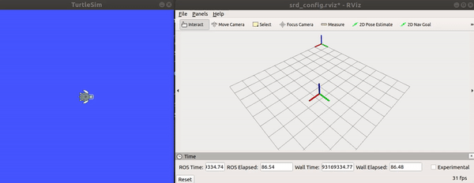

---

## Exercise 2

To launch the script:

```shell
$ roslaunch srd_exercises exercise2.launch
```

### Launchfile

The launchfile starts:
1. A *turtlesim_node* 
2. A *turtle_teleop_key* for controlling the turtle through the keyboard
3. The node *turtle1_controller*, that is used for receiving the custom message containing the command request, applying saturation if necessary, ad then publish the correct command to the turtle's *cmd_vel* topic. This node accept the parameters:
   1. *turtlename* to set which turtle to control (default='turtle1')
   2. *sat_v* (*sat_w*) to set the saturation limit
4. The node *turtle1_random_cmd*, which generates random command requests for the turtle. This node accept the parameter *turtlename* to select the turtle for which the commands are generated (and published).

```xml
<launch>
    <!-- Turtlesim Node-->
    <node pkg="turtlesim" type="turtlesim_node" name="sim"/>
    <node pkg="turtlesim" type="turtle_teleop_key" name="teleop" output="screen"/>
    <node name="turtle1_controller" pkg="srd_exercises" type="turtle_controller.py" respawn="false" output="screen" >
      <param name="turtlename" type="string" value="turtle1"/>
      <param name="sat_v" type="float" value="2.0"/>
      <param name="sat_w" type="float" value="2.0"/>
    </node>
    <node name="turtle1_random_cmd" pkg="srd_exercises" type="turtle_random_cmd.py" respawn="false" output="screen" >
      <param name="turtlename" type="string" value="turtle1"/>
    </node>
    <node name="rqt_plot" pkg="rqt_plot" type="rqt_plot"/>
</launch>
```

### Custom message

The command request is published as a custom message containing longitudinal speed and yaw rotation speed.
The message description is contained in described in */msg/Vel_custom.msg*

```
float32 lin
float32 ang
```
The *CMakeLists.txt* and the *package.xml* files have been modified accordingly, to allow the use of this message.

### Code

The code is split into the two scripts *turtle_controller.py* and *turtle_random_cmd.py*.\
The latter repeatedly generates random command for the linear and angular velocity fields of the custom message *Vel_custom*, and then publish it to the `('%s_custom_cmd' % self.turtlename)` topic.\
The first one generates a subscriber to the topic `('%s_custom_cmd' % self.turtlename)`, where the custom commands are published, that implement a callback function such that, when the message are received, they are saturated and an equivalent velocity command is published to the `('%s/cmd_vel' % self.turtlename)`, to control the turtle.

Since the actual name of the topic to which the script subscribe and publish are generated from the *turtlename* parameter given when launching the node, the same script can be used to generate multiple node that manage command requests for different turtles.
This functionality will be exploited in the next exercises.

**turtle_controller.py**

```python
class Turtle_Controller:
    def __init__(self):
        # accept as input the saturation parameters and the name of the turtle to be controlled
        rospy.init_node('turtle_controller', anonymous=True)
        self.sat_v = rospy.get_param('~sat_v', default=2.0)
        self.sat_w = rospy.get_param('~sat_w', default=2.0)
        self.turtlename = rospy.get_param('~turtlename', default='turtle1')
        self.cmd = Twist()
        self.sub = rospy.Subscriber('%s_custom_cmd' % self.turtlename, Vel_custom, self.callback)
        self.pub = rospy.Publisher('%s/cmd_vel' % self.turtlename, Twist, queue_size=20)
    def callback(self, msg):
        self.cmd.linear.x = copysign(1.0, msg.lin)*min(abs(msg.lin),self.sat_v)
        self.cmd.angular.z = copysign(1.0, msg.ang)*min(abs(msg.ang),self.sat_w)
        self.pub.publish(self.cmd)
```

**turtle_random_cmd.py**

```python
class Turtle_Control_Publisher:
    def __init__(self):
        # accept as input the name of the turtle for which command requests are published
        self.turtlename = rospy.get_param('~turtlename', default='turtle1')
        rospy.init_node('%s_random_cmd' % self.turtlename)
        self.pub = rospy.Publisher('%s_custom_cmd' % self.turtlename, Vel_custom, queue_size=20)

if __name__ == '__main__':
    try:
        turtlename = rospy.get_param('~turtlename', default='turtle1')
        hz = rospy.get_param('~hz', default=10)
        rospy.init_node('%s_random_cmd' % turtlename)
        pub = rospy.Publisher('%s_custom_cmd' % turtlename, Vel_custom, queue_size=20)
        rate = rospy.Rate(hz)
        random_cmd = Vel_custom()
        while not rospy.is_shutdown():
            random_cmd.lin = uniform(-4.,4.)
            random_cmd.ang = uniform(-4.,4.)
            pub.publish(random_cmd)
            rate.sleep()
    except rospy.ROSInterruptException:
        pass
    rospy.spin()
```

### Result

The correct behaviour of the controller can be seen from *rqt_plot*, as shown below. In the figures the saturation limit was set to 2.0 for both angular and linear velocity.\
The turtle's *cmd_vel* follows the desired command request except when it's absolute value it's greater than 2.0.
Commands' saturation has been highlighted in yellow. 


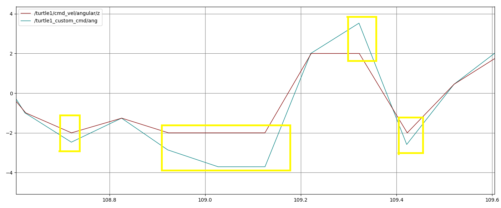

---

## Exercise 3

To launch the script:

```shell
$ roslaunch srd_exercises exercise3.launch
```

### Launchfile

This assignement has been completed introducing a variation of the random control inputs generation used for the previous one.
The difference is that this time the script *turtle_random_cmd_limit.py* is launched, instead of *turtle_random_cmd_limit.py*.
Compared to the previous one, this script starts a node that generates commands which keep the turtle in the upper part of the map. This node take as parameters the values needed to initialize an object of the *Turtle_Control_Publisher* class, described below.

```xml
<launch>
    <!-- Turtlesim Node-->
    <node pkg="turtlesim" type="turtlesim_node" name="sim"/>
    <node pkg="turtlesim" type="turtle_teleop_key" name="teleop" output="log"/>

    <node name="turtle_controller" pkg="srd_exercises" type="turtle_controller.py" respawn="false" output="screen" >
      <param name="turtlename" type="string" value="turtle1"/>
      <param name="sat_v" type="double" value="4.0"/>
      <param name="sat_w" type="double" value="4.0"/>
    </node>
    <node name="turtle_random_cmd_limit" pkg="srd_exercises" type="turtle_random_cmd_limit.py" respawn="false" output="screen" >
      <param name="turtlename" type="string" value="turtle1"/>
      <param name="y0" type="double" value="4.0"/>
    </node>

</launch>
```

### Code

The main variation of the code introduced from before is in *turtle_random_cmd_limit.py*.\
It defines the *Turtle_Control_Publisher* class, that will perform all the operation needed to generate a proper control request.\
When initialized it takes as argument the name of the turtle to be controlled, it's desired (x,y) starting position and frequency for message publication.\
It exploits the *turtlesim*'s service */teleport_absolute* to set the starting position (if it's in the upper part of the map, otherwise the turtle is set at ceneter of the map). It then creates a publisher to the topic for giving custom command to the turtle and a subscriber to the turtle's pose topic.

```python
def __init__(self,turtlename,x0,y0,hz):
        self.turtlename = turtlename
        self.x0 = x0
        self.y0 = y0
        self.hz = hz
        # check if the initial value set for y0 is correct
        if (self.y0 < 5.5) or (self.y0 >10.):
            rospy.logwarn('y0 must be set between (5., 10.)')
            self.y0 = 5.5
        self.pub = rospy.Publisher('%s_custom_cmd' % self.turtlename, Vel_custom, queue_size=20)
        rospy.wait_for_service('%s/teleport_absolute' % self.turtlename)
        try:
            self.teleporter = rospy.ServiceProxy('%s/teleport_absolute' % self.turtlename, TeleportAbsolute)
        except rospy.ServiceException as e:
            print("Service call failed: %s"%e)
        self.rate = rospy.Rate(self.hz)
        self.t = 1/self.hz
        self.pose = Pose()
        self.yp = 0.
        self.null_speed = Vel_custom(lin=0.,ang=0.)
        self.random_cmd = Vel_custom()
        self.sub = rospy.Subscriber('%s/pose' % self.turtlename,Pose,callback=self.update_pose)
```

The main method of this class is defined as *gen_cmd()*. It runs iteratively the subsequent steps, until control values that will keep the turtle in the upper part of the map are generated:
1. Generate random control inputs
2. Predict where the generated control inputs will move the turtle 

```python
def gen_cmd(self):
        rospy.loginfo('actual y: %f' % controller.pose.y)
        rospy.loginfo('predicted y: %f' % self.yp)
        self.random_cmd.lin = uniform(-3.0,3.0)
        self.random_cmd.ang = uniform(-3.0,3.0)
        v = self.random_cmd.lin
        w = self.random_cmd.ang
        # predict y if moving from the current position
        # applying both v_lin e w_ang for t = 1/hz
        self.yp = self.pose.y - v/w*(cos(self.pose.theta + w*self.t)-cos(self.pose.theta))
        while self.yp < 5.5 :
            # repeat until it finds a combination that satisfies the constraint
            self.random_cmd.lin = uniform(-3.0,3.0)
            self.random_cmd.ang = uniform(-3.0,3.0)
            v = self.random_cmd.lin
            w = self.random_cmd.ang
            self.yp = self.pose.y - v/w*(cos(self.pose.theta + w*self.t)-cos(self.pose.theta))
```
The control inputs found in this way are then published to the turtles *[turtlename]_custom_cmd* topic, where they are read and applied by the *turtle_controller* node.\
NOTE: in order to have a correct prediction of the final position the saturation limits should be set greater than the limits use to generate the random control values
```python
if __name__ == '__main__':
    try:
        # generate class instance
        rospy.init_node('turtle_random_cmd', anonymous=True)
        #
        turtlename = rospy.get_param('~turtlename', default='turtle1')
        x0 = rospy.get_param('~x0', default=5.5)
        y0 = rospy.get_param('~y0', default=5.5)
        hz = rospy.get_param('~hz', default=1)
        controller = Turtle_Control_Publisher(turtlename,x0,y0,hz)
        controller.teleport(controller.x0,controller.y0)
        while not rospy.is_shutdown():
            # first stop the turtle
            controller.pub.publish(controller.null_speed)
            # then compute velocity command
            controller.gen_cmd()
            controller.pub.publish(controller.random_cmd)
            controller.rate.sleep()
    except rospy.ROSInterruptException:
        pass
    rospy.spin()
```

### Result

The turtle effectively moves with random inputs only in the upper part of the map.
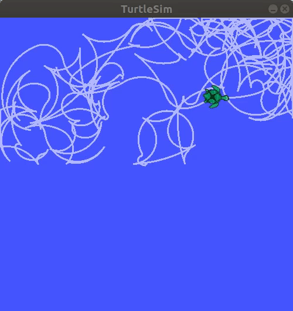
The turtle y-axis position is predicted correctly, except when the turtle hit the walls.\
A small difference (order of ~10^(-3)) can be noted between the actual value and the predicted value. It's due to the fact that the prediction is done using 1/hz as the time for which the turtle will move with the generated input; this is not the exact real value since some time is spent generating the command and publishing it.
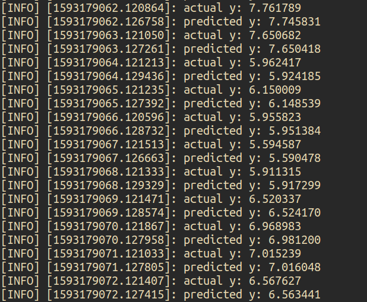

---

## Exercise 4

To launch the script:

```shell
$ roslaunch srd_exercises exercise4.launch
```
or, for a variant with more turtles,
```shell
$ roslaunch srd_exercises exercise4.launch
```

### Launchfile

The launchfiles does the following:

1. Starts a *turtlesim_node*; this generate the turtlesim instance with the first turtle at the center of the map.
2. Adds 3 more turtles in different positions of the map.
3. Starts a *turtle_controller* node for each turtle; they can be instantiated with different saturation limits, if desired.
4. Starts the *compute_baricenter* node; this node will publish updated information regarding the pose of the baricenter of the formation, each time a turtle modify its pose on the map, and will select which turtle should move (since turtles should move one at a time)
5. Starts *turtle_baricenter_cmd**i*** for each turtle. Detect when the turtle should start moving and drives it toward the formation baricenter.

The scripts have been implemented such that an arbitrary number of turtles can be added to the formation. For the code to work properly it's sufficient to follow the naming convention of calling each turtle *turtle**i***, where **i** is the number of the turtle. This same name should be passed also to the parameter *turtlename* when starting the node that will operate the individual turtle.\
An example with more turtles is shown in the "Result" section.

```xml
<launch>
    <!-- Turtlesim Node-->
    <node pkg="turtlesim" type="turtlesim_node" name="sim"/>
    
    <node pkg="rosservice" type="rosservice" name="create_turtle2" args='call --wait /spawn "{x: 2.0,y: 4.0, theta: 0.0, name: turtle2}" '/>
    <node pkg="rosservice" type="rosservice" name="create_turtle3" args='call --wait /spawn "{x: 4.0,y: 1.0, theta: 0.0, name: turtle3}" '/>
    <node pkg="rosservice" type="rosservice" name="create_turtle4" args='call --wait /spawn "{x: 10.0,y: 10.0, theta: 0.0, name: turtle4}" '/>

    <node name="turtle_controller1" pkg="srd_exercises" type="turtle_controller.py" respawn="false" output="screen" >
      <param name="turtlename" type="string" value="turtle1"/>
      <param name="sat_v" type="double" value="4.0"/>
      <param name="sat_w" type="double" value="4.0"/>
    </node>
    <node name="turtle_controller2" pkg="srd_exercises" type="turtle_controller.py" respawn="false" output="screen" >
      <param name="turtlename" type="string" value="turtle2"/>
      <param name="sat_v" type="double" value="4.0"/>
      <param name="sat_w" type="double" value="4.0"/>
    </node>
    <node name="turtle_controller3" pkg="srd_exercises" type="turtle_controller.py" respawn="false" output="screen" >
      <param name="turtlename" type="string" value="turtle3"/>
      <param name="sat_v" type="double" value="4.0"/>
      <param name="sat_w" type="double" value="4.0"/>
    </node>
    <node name="turtle_controller4" pkg="srd_exercises" type="turtle_controller.py" respawn="false" output="screen" >
      <param name="turtlename" type="string" value="turtle4"/>
      <param name="sat_v" type="double" value="4.0"/>
      <param name="sat_w" type="double" value="4.0"/>
    </node>

    <node name="compute_baricenter" pkg="srd_exercises" type="compute_baricenter.py" respawn="false" output="screen" >
      <param name="turtle_num" type="int" value="3"/>
    </node>

    <node name="turtle_baricenter_cmd1" pkg="srd_exercises" type="turtle_baricenter_cmd.py" respawn="false" output="screen" >
      <param name="turtlename" type="string" value="turtle1"/>
    </node>
    <node name="turtle_baricenter_cmd2" pkg="srd_exercises" type="turtle_baricenter_cmd.py" respawn="false" output="screen" >
      <param name="turtlename" type="string" value="turtle2"/>
    </node>
    <node name="turtle_baricenter_cmd3" pkg="srd_exercises" type="turtle_baricenter_cmd.py" respawn="false" output="screen" >
      <param name="turtlename" type="string" value="turtle3"/>
    </node>
    </node>
    <node name="turtle_baricenter_cmd4" pkg="srd_exercises" type="turtle_baricenter_cmd.py" respawn="false" output="screen" >
      <param name="turtlename" type="string" value="turtle4"/>
    </node>
    
</launch>
```

### Code

The core part of the code is composed by the scripts *compute_baricenter.py* and *turtle_baricenter_cmd.py*.\
The pipeline followed to control the turtles is as follows:
1. The *compute_baricenter* node keeps a list of all the turtles in the formation and of their pose. It contains a subscriber to each turtle's pose topic, so that when a turtle moves the position of the baricenter is updated.
2. The position of the baricenter is published on the *formation_baricenter* topic. In this way, each turtle has access to the position of the baricenter without having to receive the pose of each other turtle and compute it.
3. When a turtle should move it starts by aligning herself to the direction in which it should move to reach the baricenter (using a simple proportional control). It then start moving (driven by a proportional controller) until its distance from the baricenter of the formation is under a certain threshold (0.1 m in the case shown, it can be varied).
4. Which turtle should move is selected centrally by the *compute_baricenter*: it publishes to the topic *formation_whose_turn* the name of the turtle that should start moving. This is read by the *turtle_baricenter_cmd**i*** in the formation, which check the message published and, if correct, move the turtle.
5. Every time a turtle finish moving it publishes its name to the *formation_just_moved* topic. This is read by the central node, that can then update the information in *formation_whose_turn*.

#### compute_baricenter.py

The *Baricenter* class, defined in *compute_baricenter.py*, handle all the operations for the central management of the formation.

```python
class Baricenter:
    def __init__(self,turtle_num):
        self.turtle_num = turtle_num
        self.pose_list = []
        self.turtle_id_list = []
        self.sub_list = []
        for i in range(turtle_num):
            self.pose_list.append(Pose())
            self.turtle_id_list.append('turtle'+str(i+1))
            self.sub_list.append(
                rospy.Subscriber(
                    '/turtle'+str(i+1)+'/pose',
                    Pose,
                    callback=self.update,
                    callback_args=(i+1)
                    )
                )
        self.bar_pose = Pose()
        self.pub_bar = rospy.Publisher('formation_baricenter', Pose, queue_size=10)
        self.pub_whose_turn = rospy.Publisher('formation_whose_turn',String,queue_size=10)
        self.sub_just_moved = rospy.Subscriber('formation_just_moved',String,callback=self.select_turtle)
        rospy.sleep(0.5)
        # start movement of the first turtle
        self.pub_whose_turn.publish('turtle1')
    def update(self, msg, turtle_id):
        # update the position of the turtle that moved
        self.pose_list[turtle_id-1] = msg
        # compute the new baricenter
        self.bar_pose.x = 0.
        self.bar_pose.y = 0.
        for pose in self.pose_list:
            self.bar_pose.x = self.bar_pose.x + pose.x/self.turtle_num
            self.bar_pose.y = self.bar_pose.y + pose.y/self.turtle_num
        #rospy.loginfo('Baricenter updated: (%f,%f)' %(self.bar_pose.x,self.bar_pose.y))
        # publish the position of the baricenter
        self.pub_bar.publish(self.bar_pose)
    def select_turtle(self,msg):
        for i in range(self.turtle_num):
            if (msg.data == ('turtle'+str(i+1))):
                self.pub_whose_turn.publish('turtle'+str(((i+1) % self.turtle_num)+1))
                rospy.loginfo('Now is %s turn' % msg.data)
                break

if __name__ == '__main__':
    try:
        rospy.init_node('baricenter_computation',anonymous=True)
        turtle_num = rospy.get_param('~turtle_num')
        bar = Baricenter(turtle_num)
    except rospy.ROSInterruptException:
        pass
    rospy.spin()
```

#### turtle_baricenter_cmd.py
To run each turtle the class *Turtle_Control_Publisher* has been implemented, in *turtle_baricenter_cmd.py*

```python
class Turtle_Control_Publisher:
    def __init__(self):
        #
        rospy.init_node('turtle_random_cmd', anonymous=True)
        #
        self.turtlename = rospy.get_param('~turtlename', default='turtle1')
        self.hz = rospy.get_param('~hz', default=50)
        self.pub_cmd = rospy.Publisher('%s_custom_cmd' % self.turtlename, Vel_custom, queue_size=20)
        self.pub_just_moved = rospy.Publisher('formation_just_moved', String, queue_size=20) 
        rospy.wait_for_service('%s/teleport_absolute' % self.turtlename)
        try:
            self.teleporter = rospy.ServiceProxy('%s/teleport_absolute' % self.turtlename, TeleportAbsolute)
        except rospy.ServiceException as e:
            print("Service call failed: %s"%e)
        self.rate = rospy.Rate(self.hz)
        self.pose = Pose()
        self.bar_pose = Pose()
        self.null_speed = Vel_custom(lin=0.,ang=0.)
        self.cmd = Vel_custom()
        self.sub_pose = rospy.Subscriber('/%s/pose' % self.turtlename,Pose,callback=self.update_pose)
        self.sub_bar = rospy.Subscriber('formation_baricenter',Pose,callback=self.update_baricenter)
        self.sub_whose_turn = rospy.Subscriber('formation_whose_turn',String,callback=self.is_my_turn)
    def update_pose(self,msg):
        self.pose = msg
    def update_baricenter(self,msg):
        self.bar_pose = msg
    def teleport(self,x0,y0):
        self.teleporter(x0,y0,0.)
    def orient(self):
        self.bar_angle = atan2(self.bar_pose.y-self.pose.y, self.bar_pose.x-self.pose.x)
        e_o = 1
        while (abs(e_o)>0.01):
            e_o =  self.bar_angle-self.pose.theta
            self.cmd.ang = e_o 
            self.cmd.lin = 0.
            self.pub_cmd.publish(self.cmd)
            self.rate.sleep()
    def move_forward(self):
        e_p = 1.
        while (abs(e_p)>0.1):
            e_p = ((self.bar_pose.x-self.pose.x)**2.+(self.bar_pose.y-self.pose.y)**2.)**(1./2.)
            self.cmd.lin = e_p 
            self.cmd.ang = 0.
            self.pub_cmd.publish(self.cmd)
            self.rate.sleep()
    def is_my_turn(self,msg):
      # callback function to check whether is the turtle's turn or not
      # If it's the turtle's turn, perform all operations
        if not (msg.data == self.turtlename):
            return
        rospy.loginfo(self.turtlename+': is my turn')
        self.orient()
        self.move_forward()
        self.pub_just_moved.publish(self.turtlename)
        rospy.loginfo(self.turtlename+': I just moved')
        # stop the turtle
        self.pub_cmd.publish(self.null_speed)
```

### Result

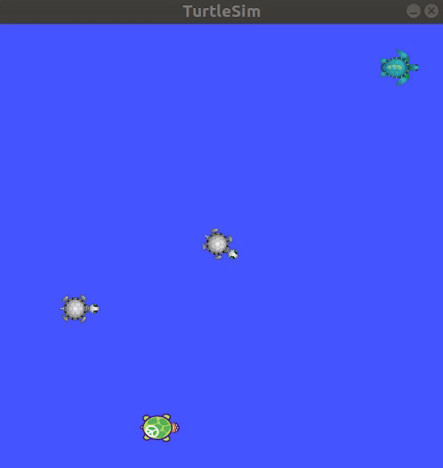
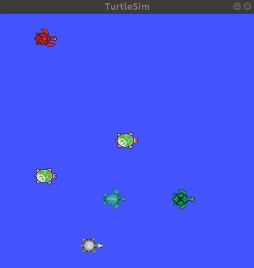

---

## Exercise 5

This assignement has been solved using the Artificial Potential Field method, illustrated during the course.

To launch the script:

```shell
$ roslaunch srd_exercises exercise5.launch
```
or

```shell
$ roslaunch srd_exercises exercise5_more_turtles.launch
```

or

```shell
$ roslaunch srd_exercises exercise5_barrier.launch
```
to launch different examples, as shown in the "Result" section


### Launchfile

The launchfile is similar to those of the other assignement; the only difference is in the node *turtle_apf_cmd*.

```xml
<launch>
    <!-- Turtlesim Node-->
    <node pkg="turtlesim" type="turtlesim_node" name="sim"/>
    <node pkg="turtlesim" type="turtle_teleop_key" name="teleop" output="log"/>

    <node pkg="rosservice" type="rosservice" name="create_turtle2" args='call --wait /spawn "{x: 2.0,y: 4.0, theta: 0.0, name: turtle2}" '/>
    <node pkg="rosservice" type="rosservice" name="create_turtle3" args='call --wait /spawn "{x: 4.0,y: 1.0, theta: 0.0, name: turtle3}" '/>

    <node name="turtle_controller1" pkg="srd_exercises" type="turtle_controller.py" respawn="false" output="screen" >
      <param name="turtlename" type="string" value="turtle1"/>
      <param name="sat_v" type="double" value="1.0"/>
      <param name="sat_w" type="double" value="1.0"/>
    </node>
    <node name="turtle_controller2" pkg="srd_exercises" type="turtle_controller.py" respawn="false" output="screen" >
      <param name="turtlename" type="string" value="turtle2"/>
    </node>
    <node name="turtle_controller3" pkg="srd_exercises" type="turtle_controller.py" respawn="false" output="screen" >
      <param name="turtlename" type="string" value="turtle3"/>
    </node>

    <node name="turtle_apf_cmd" pkg="srd_exercises" type="turtle_apf_cmd.py" respawn="false" output="screen" >
      <param name="turtle_num" type="int" value="3"/>
    </node>
    
</launch>
```

### Code
The core part of the code is contained in the file *turtle_apf_cmd.py*.\
This contain the implementation of the class *APF*, whose method performs all the operations necessary to run the algorithm and drive the moving turtle. The class is initialized similarly to the *Baricenter* class, except it contains also the method necessary for publishing the control to drive the moving turtle.

```python
class APF:
    def __init__(self,turtle_num,hz,k_rep,k_att):
        self.turtle_num = turtle_num
        self.hz = hz
        self.k_att = k_att
        self.k_rep = k_rep
        self.eta_0 = 2. # obstacle radius of influence
        self.pose_list = []
        self.turtle_id_list = []
        self.sub_list = []
        for i in range(turtle_num):
            self.pose_list.append(Pose())
            self.turtle_id_list.append('turtle'+str(i+1))
            self.sub_list.append(
                rospy.Subscriber(
                    '/turtle'+str(i+1)+'/pose',
                    Pose,
                    callback=self.update,
                    callback_args=(i+1)
                    )
                )
        self.sub_target = rospy.Subscriber('APF_target',Pose,callback=self.set_goal)
        self.rate = rospy.Rate(self.hz)
        self.null_speed = Vel_custom(lin=0.,ang=0.)
        self.apf_cmd = Vel_custom(lin=0.,ang=0.)
        self.pub_cmd = rospy.Publisher('turtle1_custom_cmd', Vel_custom, queue_size=20)
        self.goal = np.array((0.,0.))
        #self.e_goal = np.array((1.,1.))
        rospy.sleep(0.1)
```

The goal used for generating the potential field can be set by writing a Pose message to the *APF_target* topic, to which the node that generates the command is subscribed.

```python
    def set_goal(self,msg):
        self.goal = np.array((msg.x,msg.y))
        rospy.loginfo('Goal set at (%f,%f)' % (msg.x,msg.y))
        for i in range(1,turtle_num):
            rospy.loginfo('Obstacle'+str(i) + ' in (%s,%s)' %(self.pose_list[i].x, self.pose_list[i].y))
        # start moving
        self.e_goal=1.
        while ((np.linalg.norm(self.e_goal) > 0.1) and rospy.ROSInterruptException):
            self.move_turtle()
            self.rate.sleep()
        self.pub_cmd.publish(controller.null_speed)
```

In this way the field can be changed dynamically during the execution, and the turtle will start moving toward the new goal. For example to set a goal in (5.0,6.0), this can be done by calling

```shell
$ rostopic pub APF_target turtlesim/Pose 5.0 6.0 0 0 0
```
A message published to this topic is relayed to the callback function *set_goal()*. It updates the goal position and starts moving the turtle toward it. When the goal is reached (defined by a distance threshold) the turtle stops.

```python
    def set_goal(self,msg):
        self.goal = np.array((msg.x,msg.y))
        rospy.loginfo('Goal set at (%f,%f)' % (msg.x,msg.y))
        for i in range(1,turtle_num):
            rospy.loginfo('Obstacle'+str(i) + ' in (%s,%s)' %(self.pose_list[i].x, self.pose_list[i].y))
        # start moving
        self.e_goal=1.
        while ((np.linalg.norm(self.e_goal) > 0.1) and rospy.ROSInterruptException):
            self.move_turtle()
            self.rate.sleep()
        self.pub_cmd.publish(controller.null_speed)
```

The actual control command used to move the turtle are generated by the gradient of the artificial potential field, composed by the sum of an attractive field (generated by the goal) and multiple repulsive fields (generated by the obstacles).\
The field is generated from the gradients of the attractive and repulsive functions shown in the course (not reported here since GitHub Markdown doesn't support latex-style math)

It should be noted that since the control inputs are saturated, no excessive control action will be generated by an arbitrarily high error. Otherwise, it could have been appropriate to limit the attractive function to a certain threshold value.

```python
def attractive_gradient(self,x,y):
        self.e_goal = self.goal - np.array((x,y))
        return self.k_att * self.e_goal
def repulsive_gradient(self,x,y,x_obs,y_obs):
    # obstacle radius of influence eta_0 = 0.5m 
    pos = np.array((x,y))
    obs_pos = np.array((x_obs,y_obs))
    d = np.linalg.norm(pos-obs_pos)
    if d < self.eta_0:
        v = (pos-obs_pos)
        return v * self.k_rep * (1./d - 1./self.eta_0)/ (d**(3./2.))
    else:
        return np.array((0.,0.))
```

The values of k_att and k_rep can be set as parameters when launching the node from the launch file.

To actually move the vehicle along the gradient field, a modified proportional controller has been implemented

```python
    def move_turtle(self):
        curr_pos = np.array((self.pose_list[0].x,self.pose_list[0].y))
        grad = self.attractive_gradient(curr_pos[0],curr_pos[1])
        for i in range(1,turtle_num):
            grad = grad + self.repulsive_gradient(curr_pos[0],curr_pos[1],self.pose_list[i].x,self.pose_list[i].y)
        n_g = np.linalg.norm(grad)
        th_g = atan2(grad[1],grad[0])
        e_o = th_g - self.pose_list[0].theta
        self.apf_cmd.lin = 0.4*(n_g * cos(e_o))
        self.apf_cmd.ang = 10*e_o
        self.pub_cmd.publish(self.apf_cmd)
```

Finally, the class contains also a method for plotting and saving a figure of the gradient generated by the given goal's and obstacles' positions.

### Result

#### Three turtles, goal in (0.,0.)

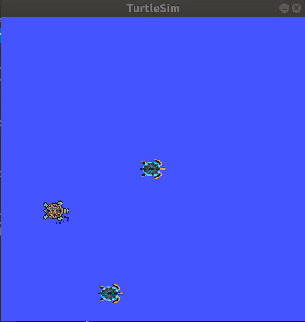

Gradient field generated:
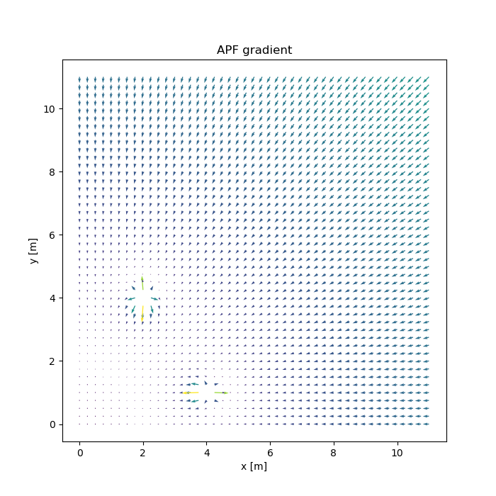

#### Six turtles, moving the goal

In this case the goal is set first in (10.,10.), then in (0.,0.) and finally in (3.,10.), to show how the turtle can navigate.

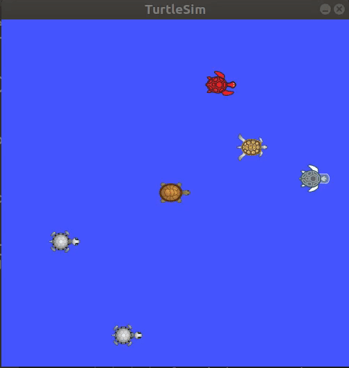

Gradient field generated by the three goals:
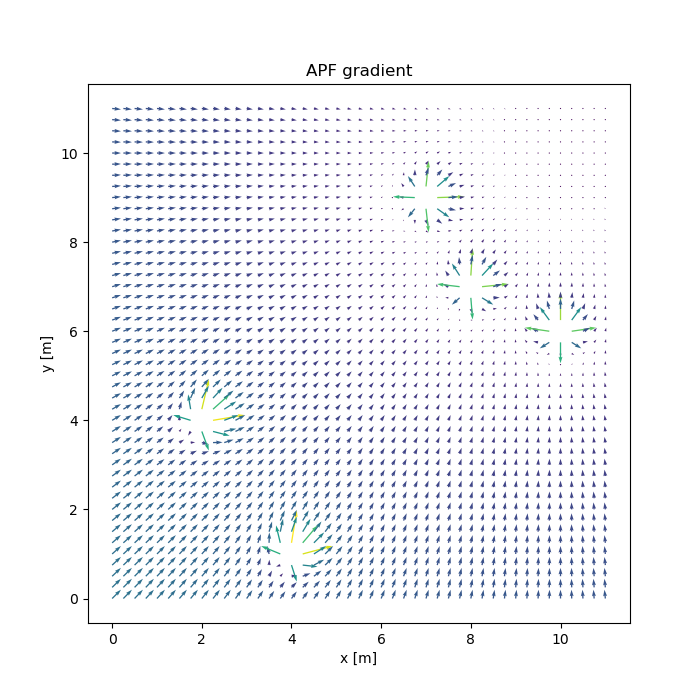
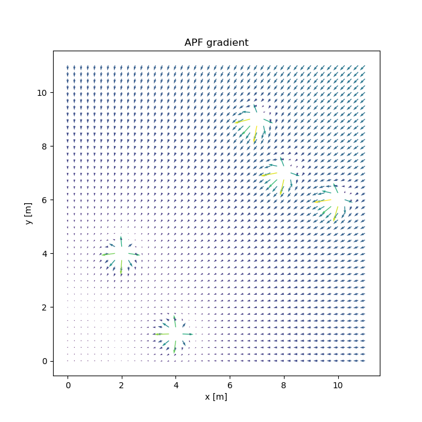
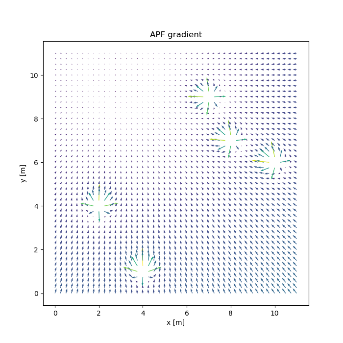


#### Local minima

Finally, it's relevant to show an example of a case where the APF method doesn't works.\
In the figures shown below the obstacles form a sort of "pocket" from which the turtle cannot exit without moving along increasing gradient directions; mathematically this corresponds to having a local minimum in the APF, in which the turtle can "fall" when moving toward the target.\
This can be generated depending on:

1. The obstacles and goal relative positions
2. The relative strength between the attractive and repulsive fields (k_att and k_rep)
3. The distance threshold above which each repulsive is "off" (eta_0)

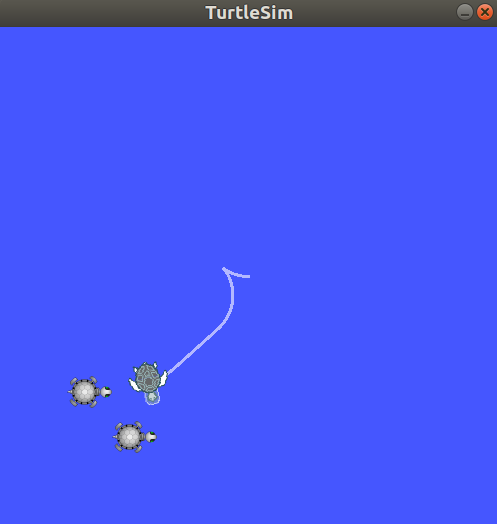
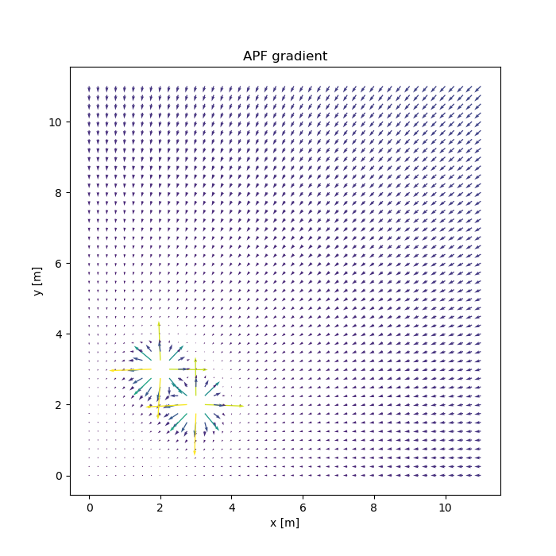


---